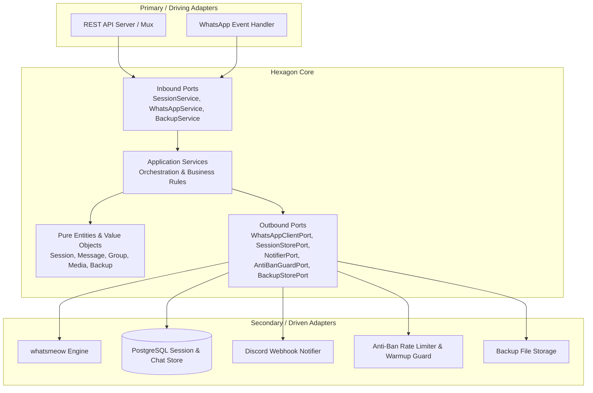

# whatsmeow-coolify-bot 🚀

Enterprise-ready WhatsApp Client & REST API Daemon yang dibangun di atas Go dan [`whatsmeow`](https://go.mau.fi/whatsmeow), dirancang khusus untuk deployment containerized di **Coolify** dengan reverse proxy **Traefik**.

## 🌟 Fitur Utama

- 🔒 **Sesi Durable di PostgreSQL**: Kredensial dan state tersimpan aman di database PostgreSQL dengan volume persisten. **Tidak akan logout saat container di-restart, server reboot, atau aplikasi di-redeploy di Coolify**.
- 🛡️ **Lapisan Anti-Ban Bertingkat (Warmup & Human Jitter)**: Membatasi kecepatan kirim pesan secara dinamis, menambahkan delay acak (jitter) menyerupai perilaku manusia, dan menerapkan kuota harian bertahap.
- 📱 **Self-Healing Pairing Code via Discord Webhook**: Jika WhatsApp melakukan logout paksa (*forced logout*), daemon secara otomatis meminta kode pairing baru dan mengirimkannya ke channel Discord. Anda dapat menautkan kembali WhatsApp langsung dari HP tanpa perlu membuka laptop atau scan barcode/QR.
- 🌐 **Clean Hexagonal Architecture (Ports & Adapters)**:
  - **Interface-First Design**: Seluruh dependensi berbasis interface (`ports/`), memudahkan mocking, unit testing, dan penggantian adapter.
  - **Single Responsibility Principle (SRP)**: Setiap paket memiliki batas tanggung jawab yang tegas (domain, ports, service, adapters).
- ⚡ **REST API Lengkap**:
  - Kirim pesan teks dan kutipan (reply).
  - Kirim file media (gambar, video, audio/voice notes PTT, dokumen PDF/arsip).
  - Baca pesan masuk dan riwayat obrolan dari database.
  - Query daftar grup, informasi metadata grup, dan daftar partisipan (admin/member).
  - **Backup Obrolan Grup**: Export seluruh riwayat percakapan beserta metadata grup ke file JSON terstruktur.
  - **Download Media**: Dekripsi dan unduh file media langsung dari CDN WhatsApp menggunakan kunci enkripsi bawaan.
- 🚦 **Coolify & Traefik Ready**: Dilengkapi label Traefik modern (SSL Let's Encrypt, compression, healthcheck `/healthz`, graceful shutdown).

---

## 🏗️ Arsitektur Sistem (Hexagonal Pattern)



---

## 📁 Struktur Direktori

```
.
├── cmd/
│   └── bot/
│       └── main.go                 # Entrypoint aplikasi & dependency wiring
├── internal/
│   ├── config/                     # Konfigurasi environment variables
│   ├── domain/                     # Entity, value object, dan business errors
│   ├── ports/                      # Interface inbound (driving) & outbound (driven)
│   ├── service/                    # Application services & business logic
│   └── adapters/
│       ├── rest/                   # HTTP REST handlers, router, & middlewares (Auth, Logger, CORS)
│       ├── whatsmeow/              # Implementasi whatsmeow client & event dispatcher
│       ├── discord/                # Notifikasi & pairing code via Discord Webhook
│       ├── antiban/                # Rate limiter, typing delay, & warmup guard
│       ├── postgres/               # Penyimpanan pesan chat & session store
│       └── backup/                 # File storage adapter untuk export backup
├── tests/                          # Suite unit & integration test
├── Dockerfile                      # Multi-stage production build (Alpine)
├── docker-compose.yml              # Deployment stack untuk Coolify (Bot + PostgreSQL)
├── .env.example                    # Template environment variables
├── go.mod
└── README.md
```

---

## 📡 REST API Reference

Semua endpoint dilindungi oleh middleware autentikasi jika `API_KEY` dikonfigurasi. Sertakan header:
`X-API-Key: <rahasia>` atau `Authorization: Bearer <rahasia>`.

### 1. Healthcheck (Unauthenticated)
- **`GET /healthz`**
  - Digunakan oleh Traefik & Coolify untuk probe kesehatan kontainer.
  - Return: `200 OK` (dengan teks `ok` atau `waiting_pairing`).

### 2. Session & Lifecycle
| Method | Endpoint | Deskripsi |
|---|---|---|
| `GET` | `/api/v1/session/status` | Cek status koneksi, pairing, JID, uptime, dan info device |
| `GET` | `/api/v1/session/qr` | Tampilan Web Live QR Code (Browser) atau JSON data untuk pemindaian instan |
| `POST` | `/api/v1/session/pair` | Memicu generate pairing code 8-digit baru untuk nomor tertentu |
| `POST` | `/api/v1/session/disconnect` | Memutus koneksi WhatsApp secara terkontrol |

**Contoh Request Pairing Manual:**
```bash
curl -X POST https://wa.domainkamu.com/api/v1/session/pair \
  -H "Content-Type: application/json" \
  -H "X-API-Key: your-api-key" \
  -d '{
    "phone_number": "6281234567890",
    "client_name": "Chrome (Linux)"
  }'
```

### 3. Pesan & Media
| Method | Endpoint | Deskripsi |
|---|---|---|
| `POST` | `/api/v1/messages/send-text` | Kirim pesan teks dengan proteksi rate limit anti-ban |
| `POST` | `/api/v1/messages/send-media` | Kirim media (Multipart form atau Base64 JSON) |
| `POST` | `/api/v1/media/download` | Unduh file terenkripsi dari CDN WhatsApp |
| `GET` | `/api/v1/chats/{jid}/messages` | Ambil riwayat percakapan dari database lokal |

**Contoh Kirim Pesan Teks:**
```bash
curl -X POST https://wa.domainkamu.com/api/v1/messages/send-text \
  -H "Content-Type: application/json" \
  -H "X-API-Key: your-api-key" \
  -d '{
    "recipient": "6281234567890@s.whatsapp.net",
    "content": "Halo! Pesan ini dikirim otomatis via REST API whatsmeow."
  }'
```

**Contoh Kirim Media (Multipart File Upload):**
```bash
curl -X POST https://wa.domainkamu.com/api/v1/messages/send-media \
  -H "X-API-Key: your-api-key" \
  -F "recipient=6281234567890@s.whatsapp.net" \
  -F "type=image" \
  -F "caption=Foto dokumentasi rapat" \
  -F "file=@/path/to/image.jpg"
```

### 4. Manajemen Grup & Backup
| Method | Endpoint | Deskripsi |
|---|---|---|
| `GET` | `/api/v1/groups` | Mendapatkan daftar grup yang diikuti akun bot |
| `GET` | `/api/v1/groups/{jid}` | Mengambil detail info grup, admin, dan partisipan |
| `POST` | `/api/v1/groups/{jid}/backup` | Membuat backup riwayat chat grup ke file JSON |
| `GET` | `/api/v1/backups` | Melihat daftar arsip backup yang telah dibuat |
| `GET` | `/api/v1/backups/{id}` | Mengunduh file arsip backup |

**Contoh Membuat Backup Grup:**
```bash
curl -X POST https://wa.domainkamu.com/api/v1/groups/120363012345678901@g.us/backup \
  -H "X-API-Key: your-api-key" \
  -H "Content-Type: application/json" \
  -d '{
    "limit": 1000,
    "include_media": true,
    "format": "json"
  }'
```

---

## 🚀 Panduan Deploy ke Coolify (Langkah demi Langkah)

### 1. Push Repositori ke GitHub
Repositori ini sudah diinisialisasi dengan git dan siap di-push ke akun GitHub Anda.
> [!TIP]
> Disarankan menggunakan repositori privat di GitHub karena mencakup struktur penanganan session kerja.

### 2. Konfigurasi di Coolify Dashboard
1. Buka dashboard **Coolify** Anda.
2. Klik **Projects** ➔ Pilih environment ➔ Klik **+ New Resource**.
3. Pilih **Docker Compose** (pilihan ini penting agar PostgreSQL terdeploy otomatis sebagai *companion service*).
4. Pilih **GitHub App** Anda dan pilih repo `whatsmeow-coolify-bot`.
5. Coolify akan mendeteksi file `docker-compose.yml` secara otomatis.

### 3. Atur Environment Variables
Di tab **Environment Variables** Coolify, tambahkan variabel berikut:

```env
PORT=8080
WA_PHONE_NUMBER=6281234567890
WA_CLIENT_NAME=Chrome (Linux)
DISCORD_WEBHOOK_URL=https://discord.com/api/webhooks/.../...
API_KEY=kunci-rahasia-anda-yang-aman
ANTIBAN_PRESET=moderate
POSTGRES_USER=postgres
POSTGRES_PASSWORD=generate_password_acak_disini
POSTGRES_DB=whatsmeow
COOLIFY_FQDN=wa.domainanda.com
```

### 4. Pastikan Persistent Volume Aktif
Periksa tab **Storages** di service `wa-postgres` Coolify:
- Pastikan volume `wa_data` terpasang di mount path `/var/lib/postgresql/data`.
- Ini adalah kunci utama agar sesi tidak hilang ketika kontainer di-restart.

### 5. Deploy & Pairing Pertama Kali (Dual-Onboarding UX)
1. Klik tombol **Deploy** di Coolify.
2. Tunggu ~1 menit hingga image selesai dibangun dan kontainer berstatus **healthy**.
3. Pilih salah satu dari dua metode onboarding instan:

#### Opsi A: Scan Live QR Code (Paling Cepat & Anti-Rate Limit)
- Buka browser ke: `https://wa.domainanda.com/api/v1/session/qr` (atau tambahkan `?api_key=your-key` jika API Key disetel).
- Halaman web responsif akan menampilkan **Live QR Code** yang auto-refresh setiap 3 detik.
- Buka WhatsApp HP ➔ **Perangkat Tertaut** ➔ **Tautkan Perangkat** ➔ Arahkan kamera ke layar.
- **Keunggulan**: Langsung terhubung dalam hitungan detik tanpa dipengaruhi limitasi kuota SMS/kode pairing telepon!

#### Opsi B: Pairing Code 8-Digit via Discord Webhook
- Pantau channel Discord Anda, bot akan mengirimkan urutan pesan onboarding:
  - **Notifikasi 1**: `:rocket: whatsmeow-coolify-bot berhasil dijalankan di Coolify!`
  - **Notifikasi 2**: `⏳ Menginisialisasi WhatsApp Pairing...`
  - **Notifikasi 3**: Embed hijau berisi **Kode Pairing 8 Digit** (misal: `ABCD-1234`).
- Buka WhatsApp HP ➔ **Perangkat Tertaut** ➔ **Tautkan dengan nomor telepon saja** ➔ Masukkan 8 digit kode.

> [!TIP]
> **Troubleshooting Onboarding**:
> - **Bypass Error 429 (`rate-overlimit`)**: Jika nomor telepon Anda terkena limitasi cooldown 429 dari WhatsApp, **cukup buka URL web QR code (`/api/v1/session/qr`) di browser Anda dan pindai QR code langsung dari HP**. Scan QR menggunakan jalur negosiasi terpisah sehingga tidak terpengaruh oleh rate limit nomor telepon!
> - **Pengecekan Status via API**: Anda dapat memantau status pairing kapan saja dengan menjalankan:
>   `curl https://wa.domainanda.com/api/v1/session/status` (field `action_needed` akan memandu tindakan Anda).
> - **Picu Ulang Manual**: Anda juga dapat memicu kode baru secara manual lewat:
>   `curl -X POST https://wa.domainanda.com/api/v1/session/pair -H "Content-Type: application/json" -d '{"phone_number": "628xxx"}'`.

---

## ⏰ Background Maintenance Engine & Scheduler

Bot dilengkapi dengan *Lightweight In-Process Maintenance Engine* otonom:
1. **Anti-Ban Memory Hygiene**:
   - Membersihkan rekam jejak timestamp penerima di memori setiap 15 menit (`PruneStale`).
   - Mencegah kebocoran memori (*memory leak*) meskipun bot melayani ribuan nomor kontak selama berbulan-bulan.
2. **Deterministic Midnight Reset**:
   - Me-reset kuota kirim harian (`dailyCount`) tepat pukul 00:00 setiap malam dan mencatat metrik ke log.
3. **Backup Storage Housekeeping**:
   - Memangkas (*purge*) file arsip backup JSON lama yang melewati batas retensi (`BACKUP_RETENTION_DAYS`, default 30 hari).
4. **Automated Group Backup**:
   - Jika `BACKUP_SCHEDULED_GROUPS` diisi dengan daftar JID grup (dipisahkan koma), engine akan mengekspor backup riwayat obrolan secara otomatis sesuai interval (`BACKUP_INTERVAL_HOURS`, default 24 jam) dan mengirim laporan ke Discord.

## 🛡️ Anti-Ban Guard Presets

| Preset | Delay Kirim | Max Burst | Kuota Harian | Rekomendasi Penggunaan |
|---|---|---|---|---|
| `strict` | 4–8 detik | 5 pesan | 80 pesan/hari | Nomor WhatsApp baru / akun sensitif |
| `moderate` | 2–5 detik | 15 pesan | 300 pesan/hari | Penggunaan standar sehari-hari |
| `relaxed` | 1–3 detik | 30 pesan | 1000 pesan/hari | Akun resmi/tua dengan reputasi tinggi |

Setiap pengiriman pesan melalui `WhatsAppService` melewati mekanisme anti-ban yang menghentikan lonjakan (*burst suppression*), mensimulasikan latensi ketik manusia, dan menolak pengiriman jika kuota harian habis.

---

## 🧪 Menjalankan Unit Test

Proyek ini dilengkapi test suite lengkap untuk memverifikasi anti-ban guard, session supervisor, REST endpoints, dan backup store:

```bash
go test -v ./tests
```

---

## ⚖️ Lisensi
Didistribusikan di bawah lisensi MIT.
